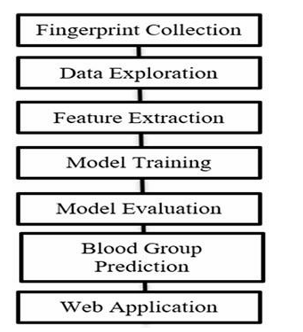

# Fingerprint-Based Blood Group Detection Using CNN

## 📄 Abstract
Blood sample collection and laboratory testing for traditional blood group detection can be time-consuming, intrusive, and resource-intensive. This project presents a novel, non-invasive technique for classifying blood groups using Convolutional Neural Networks (CNNs) and fingerprint-based analysis. 

Research indicates that distinctive ridge elements in fingerprint patterns correlate with blood group traits. This AI-powered system captures fingerprint images, preprocesses them, and extracts distinguishing features to classify individuals into 8 blood groups (A, B, AB, O, both positive and negative). Trained on a comprehensive dataset of over 6,000 images, the model achieves an overall predictive accuracy of 88%, paving the way for faster, non-invasive biomedical diagnostics.

## 💡 What Problem Does This Solve?
* **Eliminates Intrusive Procedures:** Replaces needles and blood draws with simple biometric scanning.
* **Reduces Time & Resources:** Bypasses the need for traditional laboratory processing, offering rapid results.
* **Emergency Medical Support:** Facilitates immediate blood group identification in critical situations where rapid transfusion procedures are essential.
* **Streamlined Administration:** Offers an easier, automated option for healthcare diagnostics and blood donation camp management.

## 📊 Dataset Used
The model is trained and evaluated using the **Finger Print Based Blood Group Dataset**. 
* **Size:** 6,000+ labeled fingerprint images (bmp format).
* **Classes:** 8 (A+, A-, B+, B-, AB+, AB-, O+, O-).
* **Source:** Kaggle (Author: R. Mavinmar)
* **Link:** [Download Dataset Here](https://www.kaggle.com/datasets/rajumavinmar/fingerprint-based-blood-group-dataset?resource=download)

## ⚙️ Workflow Architecture
The system follows a linear pipeline from data collection to final deployment in a user-facing application:

1. **Fingerprint Collection:** Acquiring raw biometric data.
2. **Data Exploration:** Analyzing and preprocessing the dataset for quality.
3. **Feature Extraction:** Identifying distinct ridge elements using deep learning.
4. **Model Training:** Training the CNN on the labeled fingerprint dataset.
5. **Model Evaluation:** Testing for precision, recall, and an overall accuracy of 88%.
6. **Blood Group Prediction:** Classifying new inputs into one of the 8 blood groups.
7. **Web Application:** Deploying the model into an accessible, user-friendly interface.

## 🛠️ Tech Stack
* **Machine Learning & AI:** Python, Convolutional Neural Networks (CNNs), TensorFlow , Keras
* **Data Processing:** Pandas, NumPy, OpenCV (for image preprocessing)
* **Frontend Development:**  HTML5
* **Backend :** Flask

## 📚 Publication Details
This research has been peer-reviewed and published.
* **Conference:** Proceedings of International Conference on Wireless Communication (ICWiCom) 2025
* **Publisher:** Springer
* **Read the Paper:** *https://link.springer.com/chapter/10.1007/978-981-95-3616-0_21*

---
*Developed as an exploration into the intersection of AI, biometrics, and non-invasive healthcare diagnostics.*